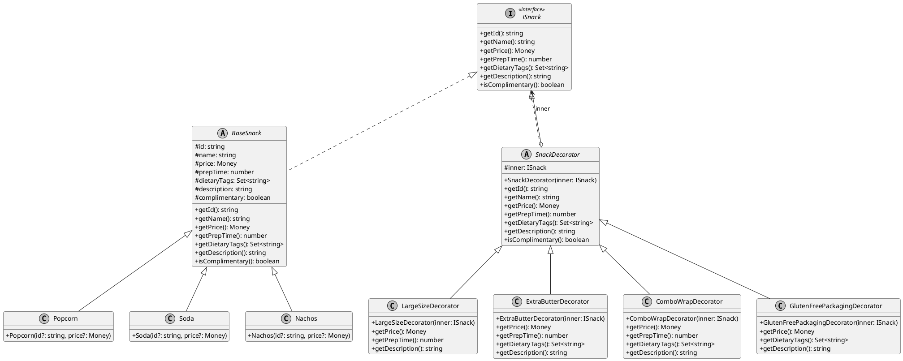
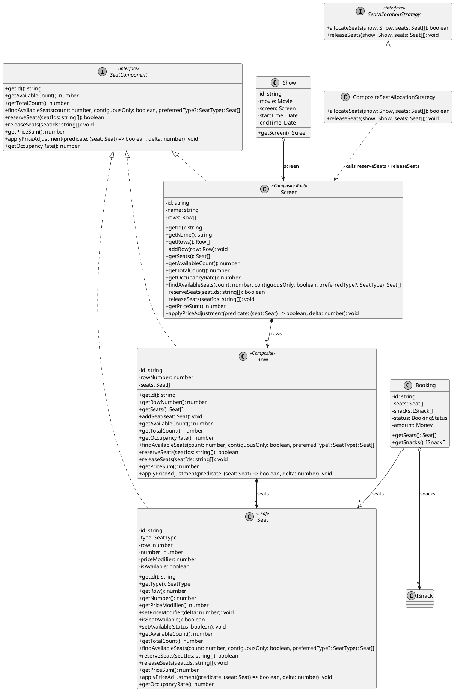
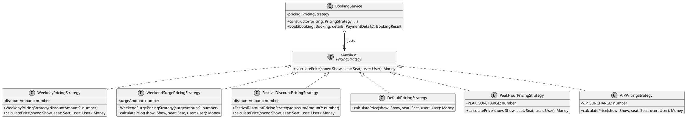
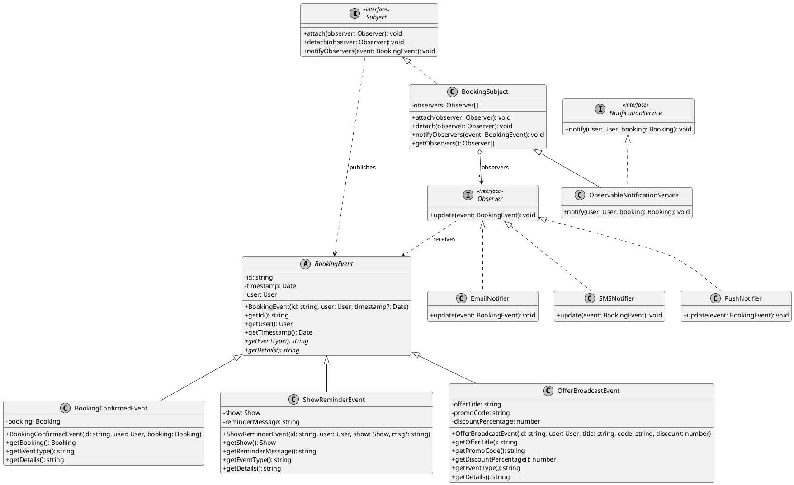
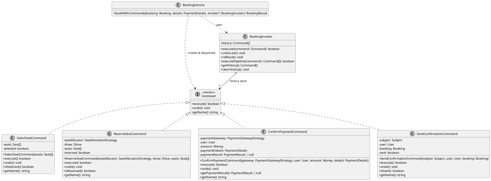
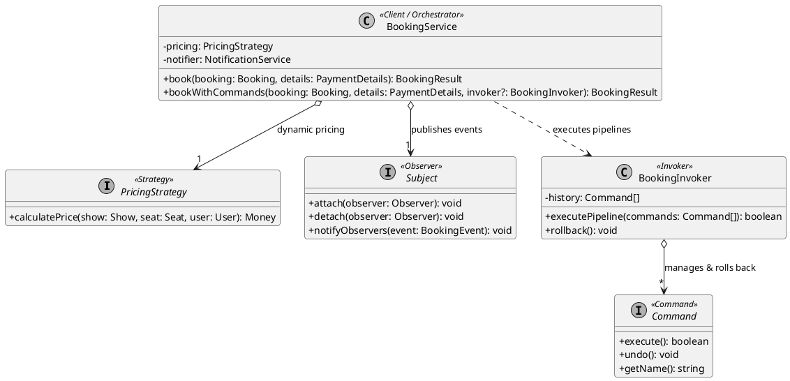

# Movie Booking System (Low-Level Design)

A highly structured, clean-architecture Low-Level Design (LLD) implementation of a Movie Booking System in TypeScript. This project demonstrates object-oriented design principles (SOLID), dependency injection, and several behavioral and creational design patterns.

---

## 🏗️ Architecture & Design Patterns

The project follows clean architectural boundaries by separating data structures, interfaces, and concrete business logic.

### Design Patterns Used

#### Creational Patterns

1. **Simple Factory Pattern**:
   - **Ticket Factory** (`TicketFactory`, `SimpleTicketFactory`): Encapsulates polymorphic creation of `Ticket` subclasses (`StandardTicket`, `PremiumTicket`, `IMAXTicket`, `ReclinerTicket`) based on `TicketType` and seat validation.
2. **Builder Pattern**:
   - **Booking Builders** (`BookingBuilder`, `RegularBookingBuilder`, `VIPBookingBuilder`): Separates the step-by-step construction of complex `Booking` objects from their representation. Supports fluent addition of tickets, snacks, coupons, loyalty points, and special requests, with validation before instantiating immutable bookings. `VIPBookingBuilder` enforces VIP-specific invariants (disallowing standard tickets, auto-injecting complimentary welcome snacks).
3. **Singleton Pattern**:
   - **Logger** (`Logger` implementing `LoggingService`): A lazily initialized, shared logging instance accessed via `Logger.getInstance()` and injected into `BookingService` via constructor injection to maintain testability.

#### Structural Patterns

1. **Decorator Pattern**:
   - **Snack Add-ons** (`ISnack`, `BaseSnack`, `Popcorn`, `Soda`, `Nachos`, `SnackDecorator`, `LargeSizeDecorator`, `ExtraButterDecorator`, `ComboWrapDecorator`, `GlutenFreePackagingDecorator`): Encapsulates dynamic snack customization and pricing without subclass explosion. Correctly aggregates dynamic pricing, preparation time, and dietary tags (`vegetarian`, `contains-dairy`, `combo-deal`, `gluten-free-certified`).
2. **Composite Pattern**:
   - **Theater Layout Hierarchy** (`SeatComponent`, `Seat`, `Row`, `Screen`): Establishes a 3-tier hierarchy (`Screen` → `Row` → `Seat`) allowing uniform operations across leaf nodes and composite containers. Supports contiguous seat search, atomic multi-seat reservation, row-level stats, screen-wide occupancy calculation, and batch price adjustments.

#### Behavioral Patterns

1. **Strategy Pattern (Dynamic Pricing)**:
   - Dynamic surcharge and discount calculation decoupled from `BookingService`.
   - Strategies implemented: `WeekdayPricingStrategy` (weekday concession), `WeekendSurgePricingStrategy` (weekend demand surge), `FestivalDiscountPricingStrategy` (promotional festival discounts), `DefaultPricingStrategy`, `PeakHourPricingStrategy`, and `VIPPricingStrategy`.
   - Strategies are injected into `BookingService` at runtime via Dependency Injection.
2. **Observer Pattern (Real-Time Multi-Channel Notifications)**:
   - Event-driven subscriber model decoupling notification delivery from core booking transactions.
   - Core contracts: `Subject` and `Observer`.
   - Event hierarchy: `BookingEvent` base class with concrete events (`BookingConfirmedEvent`, `ShowReminderEvent`, `OfferBroadcastEvent`).
   - Concrete notifiers: `EmailNotifier`, `SMSNotifier`, and `PushNotifier`.
   - Thread/iteration safety: uses snapshot array copies during event dispatch.
   - `ObservableNotificationService` bridges `NotificationService` and `BookingSubject` for seamless integration into `BookingService`.
3. **Command Pattern (Transactional Booking Actions & LIFO Rollback)**:
   - Encapsulates booking operations into discrete, reversible command objects implementing `execute(): boolean` and `undo(): void`.
   - Concrete commands: `SelectSeatCommand`, `ReserveSeatCommand`, `ConfirmPaymentCommand`, and `SendConfirmationCommand`.
   - `BookingInvoker` executes command pipelines and maintains a history stack. Upon any downstream failure (e.g., payment declined), it performs an automatic LIFO rollback, undoing prior commands and restoring reserved seats to available status.
4. **Repository Pattern**: Abstracted persistence using an in-memory data store for `Booking` objects (`BookingRepository`).
5. **Dependency Injection**: Dependencies (`PricingStrategy`, `SeatAllocationStrategy`, `PaymentGatewayStrategy`, `BookingRepository`, `NotificationService`, `LoggingService`) are injected into the orchestrator `BookingService` constructor for inversion of control and decoupled testability.

---

## 📂 Project Structure

```text
src/
├── command/          # Command pattern (Command, SelectSeat, ReserveSeat, ConfirmPayment, SendConfirmation, BookingInvoker)
├── enums/            # Domain-specific enumerations (SeatType, TicketType, BookingStatus, SeatStatus)
├── interfaces/       # Core domain contracts, strategy definitions, builders, and factories
├── model/            # Core domain entities (User, Movie, Seat, Row, Show, Screen, Booking, Snack, Coupon, Money, etc.)
├── observer/         # Observer pattern (Subject, Observer, BookingSubject, events, notifiers)
│   ├── events/       # Event hierarchy (BookingEvent, BookingConfirmedEvent, ShowReminderEvent, OfferBroadcastEvent)
│   └── notifiers/    # Concrete observers (EmailNotifier, SMSNotifier, PushNotifier)
├── repository/       # Data access and storage layers (BookingRepository)
├── service/          # Core orchestrator business logic (BookingService, book, bookWithCommands)
├── serviceimpl/      # Concrete implementations
│   ├── notification/ # Notification services (EmailNotification, ObservableNotificationService)
│   ├── payment-gateway/ # Payment gateways (MockPaymentGateway with failure simulation)
│   ├── pricing/      # Dynamic pricing strategies (Weekday, WeekendSurge, FestivalDiscount, PeakHour, VIP)
│   └── seatAllocation/ # Seat allocation strategies (InMemorySeatAllocation, CompositeSeatAllocation)
├── snacks/           # Snack components and decorators (Popcorn, Soda, Nachos, LargeSize, ExtraButter, ComboWrap, GlutenFree)
├── tickets/          # Polymorphic ticket hierarchy (Ticket, StandardTicket, PremiumTicket, IMAXTicket, ReclinerTicket)
└── main.ts           # Composition root, dependency wiring, and 11 demo scenarios
```

---

## ⚙️ Getting Started

### Prerequisites

- [Node.js](https://nodejs.org/) (v16+)

### Installation

Clone the repository and install the development dependencies:

```bash
npm install
```

### Run the Application

To run the main execution workflow (demonstrating all 11 demo scenarios across creational, structural, and behavioral patterns: Regular Booking, VIP Booking with auto-complimentary snacks, VIP validation error handling, Decorator snack composition, Composite theater layout reservation, integrated booking, Strategy dynamic pricing, Observer multi-channel notifications and dynamic unsubscription, Command transactional execution, Command automatic rollback on payment failure, and BookingService command integration):

```bash
npm start
```

---

## 📊 UML Diagrams

Below is the PlantUML syntax for the system's design diagrams. You can render these using any PlantUML viewer or editor.

### Class Diagram

```plantuml
@startuml
skinparam style strictuml
skinparam classAttributeIconSize 0

enum SeatType {
  NORMAL
  PREMIUM
  VIP
}

enum SeatStatus {
  AVAILABLE
  BOOKED
}

enum TicketType {
  STANDARD
  PREMIUM
  IMAX
  RECLINER
}

enum BookingStatus {
  PENDING
  CONFIRMED
  FAILED
  CANCELLED
}

class Money {
  - amount: number
  + constructor(amount: number)
  + getAmount(): number
  + {static} zero(): Money
  + add(newMoney: Money): Money
  + toDisplayString(): string
}

class Address {
  - street: string
  - city: string
  - state: string
  - pincode: string
  + constructor(street: string, city: string, state: string, pincode: string)
  + getStreet(): string
  + setStreet(street: string): void
  + getCity(): string
  + setCity(city: string): void
  + getState(): string
  + setState(state: string): void
  + getPincode(): string
  + setPincode(pincode: string): void
}

class User {
  - id: string
  - name: string
  - email: string
  - phone: string
  - address: Address
  + constructor(id: string, name: string, email: string, phone: string, address: Address)
  + getId(): string
  + setId(id: string): void
  + getName(): string
  + setName(name: string): void
  + getEmail(): string
  + setEmail(email: string): void
  + getPhone(): string
  + setPhone(phone: string): void
  + getAddress(): Address
  + setAddress(address: Address): void
}

class Movie {
  - id: string
  - title: string
  - duration: number
  - genre: string
  - language: string
  - rating: string
  + constructor(id: string, title: string, durationInMinutes: number, genre: string, language: string, rating: string)
  + getId(): string
  + setId(id: string): void
  + getTitle(): string
  + setTitle(title: string): void
  + getDuration(): number
  + setDuration(durationInMinutes: number): void
  + getGenre(): string
  + setGenre(genre: string): void
  + getLanguage(): string
  + setLanguage(language: string): void
  + getRating(): string
  + setRating(rating: string): void
}

class Seat {
  - id: string
  - type: SeatType
  - row: number
  - number: number
  + constructor(id: string, type: SeatType, row: number, number: number)
  + getId(): string
  + setId(id: string): void
  + getType(): SeatType
  + setType(type: SeatType): void
  + getRow(): number
  + setRow(row: number): void
  + getNumber(): number
  + setNumber(number: number): void
}

class Screen {
  - id: string
  - name: string
  - seats: Seat[]
  + constructor(id: string, name: string, seats: Seat[])
  + getId(): string
  + setId(id: string): void
  + getName(): string
  + setName(name: string): void
  + getSeats(): Seat[]
  + setSeats(seats: Seat[]): void
}

class Theater {
  - id: string
  - name: string
  - address: Address
  - screens: Screen[]
  + constructor(id: string, name: string, address: Address, screens: Screen[])
  + getId(): string
  + setId(id: string): void
  + getName(): string
  + setName(name: string): void
}

class Show {
  - id: string
  - movie: Movie
  - screen: Screen
  - startTime: Date
  - endTime: Date
  + constructor(id: string, movie: Movie, screen: Screen, start: Date, end: Date)
  + getId(): string
  + setId(id: string): void
  + getMovie(): Movie
  + setMovie(movie: Movie): void
  + getScreen(): Screen
  + setScreen(screen: Screen): void
  + getStartTime(): Date
  + setStartTime(start: Date): void
  + getEndTime(): Date
  + setEndTime(end: Date): void
}

class Snack {
  - id: string
  - name: string
  - price: Money
  - complimentary: boolean
  + constructor(id: string, name: string, price: Money, complimentary: boolean)
  + getId(): string
  + setId(id: string): void
  + getName(): string
  + setName(name: string): void
  + getPrice(): Money
  + setPrice(price: Money): void
  + isComplimentary(): boolean
  + setComplimentary(complimentary: boolean): void
}

class Coupon {
  - code: string
  - discountAmount: Money
  + constructor(code: string, discountAmount: Money)
  + getCode(): string
  + setCode(code: string): void
  + getDiscountAmount(): Money
  + setDiscountAmount(discountAmount: Money): void
}

abstract class Ticket {
  - seat: Seat
  + constructor(seat: Seat)
  + getSeat(): Seat
  + {abstract} getType(): TicketType
  + {abstract} getBasePrice(): Money
  + {abstract} getAmenities(): string[]
  + {abstract} getAllowedSeatTypes(): SeatType[]
}

class StandardTicket extends Ticket {
  + constructor(seat: Seat)
  + getType(): TicketType
  + getBasePrice(): Money
  + getAmenities(): string[]
  + getAllowedSeatTypes(): SeatType[]
}

class PremiumTicket extends Ticket {
  + constructor(seat: Seat)
  + getType(): TicketType
  + getBasePrice(): Money
  + getAmenities(): string[]
  + getAllowedSeatTypes(): SeatType[]
}

class IMAXTicket extends Ticket {
  + constructor(seat: Seat)
  + getType(): TicketType
  + getBasePrice(): Money
  + getAmenities(): string[]
  + getAllowedSeatTypes(): SeatType[]
}

class ReclinerTicket extends Ticket {
  + constructor(seat: Seat)
  + getType(): TicketType
  + getBasePrice(): Money
  + getAmenities(): string[]
  + getAllowedSeatTypes(): SeatType[]
}

class PaymentDetails {
  - method: PaymentMethod
  + constructor(method: PaymentMethod)
  + getMethod(): PaymentMethod
}

class PaymentResult {
  - success: boolean
  - transactionId: string | null
  - failureReason: string | null
  + constructor(success: boolean, transactionId: string | null, failureReason: string | null)
  + isSuccess(): boolean
  + setSuccess(success: boolean): void
  + getTransactionId(): string | null
  + setTransactionId(transactionId: string | null): void
  + getFailureReason(): string | null
  + setFailureReason(failureReason: string | null): void
}

class Booking {
  - id: string
  - show: Show
  - user: User
  - seats: Seat[]
  - status: BookingStatus
  - amount: Money
  - tickets: Ticket[]
  - snacks: Snack[]
  - coupon: Coupon | null
  - loyaltyPoints: number
  - specialRequests: string[]
  + constructor(id: string, show: Show, user: User, seats: Seat[], status: BookingStatus, amount: Money, tickets: Ticket[], snacks: Snack[], coupon: Coupon | null, loyaltyPoints: number, specialRequests: string[])
  + getId(): string
  + setId(id: string): void
  + getShow(): Show
  + setShow(show: Show): void
  + getUser(): User
  + setUser(user: User): void
  + getSeats(): Seat[]
  + setSeats(seats: Seat[]): void
  + getStatus(): BookingStatus
  + setStatus(status: BookingStatus): void
  + getAmount(): Money
  + setAmount(amount: Money): void
  + getTickets(): Ticket[]
  + setTickets(tickets: Ticket[]): void
  + getSnacks(): Snack[]
  + setSnacks(snacks: Snack[]): void
  + getCoupon(): Coupon | null
  + setCoupon(coupon: Coupon | null): void
  + getLoyaltyPoints(): number
  + setLoyaltyPoints(loyaltyPoints: number): void
  + getSpecialRequests(): string[]
  + setSpecialRequests(specialRequests: string[]): void
}

class BookingResult {
  - ok: boolean
  - booking: Booking | null
  - errorMessage: string | null
  - constructor(ok: boolean, booking: Booking | null, errorMessage: string | null)
  + isOk(): boolean
  + getBooking(): Booking | null
  + getErrorMessage(): string | null
  + {static} success(booking: Booking): BookingResult
  + {static} fail(errorMessage: string): BookingResult
}

interface TicketFactory {
  + createTicket(type: TicketType, seat: Seat): Ticket
}

class SimpleTicketFactory implements TicketFactory {
  + createTicket(type: TicketType, seat: Seat): Ticket
}

interface BookingBuilder {
  + forShow(show: Show): BookingBuilder
  + forUser(user: User): BookingBuilder
  + addTicket(seat: Seat, ticketType: TicketType): BookingBuilder
  + addSnack(snack: Snack): BookingBuilder
  + applyCoupon(coupon: Coupon): BookingBuilder
  + withLoyaltyPoints(points: number): BookingBuilder
  + withSpecialRequest(text: string): BookingBuilder
  + build(): Booking
}

class RegularBookingBuilder implements BookingBuilder {
  # ticketFactory: TicketFactory
  # show: Show | null
  # user: User | null
  # tickets: Ticket[]
  # snacks: Snack[]
  # coupon: Coupon | null
  # loyaltyPoints: number
  # specialRequests: string[]
  + constructor(ticketFactory: TicketFactory)
  + forShow(show: Show): BookingBuilder
  + forUser(user: User): BookingBuilder
  + addTicket(seat: Seat, ticketType: TicketType): BookingBuilder
  + addSnack(snack: Snack): BookingBuilder
  + applyCoupon(coupon: Coupon): BookingBuilder
  + withLoyaltyPoints(points: number): BookingBuilder
  + withSpecialRequest(text: string): BookingBuilder
  # validate(): void
  # generateBookingId(): string
  # reset(): void
  + build(): Booking
}

class VIPBookingBuilder extends RegularBookingBuilder {
  + constructor(ticketFactory: TicketFactory)
  + build(): Booking
}

interface PricingStrategy {
  + calculatePrice(show: Show, seat: Seat, user: User): Money
}

interface SeatAllocationStrategy {
  + allocateSeats(show: Show, seats: Seat[]): boolean
  + releaseSeats(show: Show, seats: Seat[]): void
}

interface PaymentGatewayStrategy {
  + charge(user: User, amount: Money, paymentMethod: PaymentDetails): PaymentResult
}

interface NotificationService {
  + notify(user: User, booking: Booking): void
}

interface LoggingService {
  + info(msg: string): void
  + warn(msg: string): void
  + error(msg: string): void
}

class Logger implements LoggingService {
  - {static} instance: Logger | null
  - constructor()
  + {static} getInstance(): Logger
  + info(msg: string): void
  + warn(msg: string): void
  + error(msg: string): void
}

class DefaultPricingStrategy implements PricingStrategy {
  + calculatePrice(show: Show, seat: Seat, user: User): Money
}

class PeakHourPricingStrategy implements PricingStrategy {
  - {static} readonly PEAK_SURCHARGE: number
  + calculatePrice(show: Show, seat: Seat, user: User): Money
}

class VIPPricingStrategy implements PricingStrategy {
  - {static} readonly VIP_SURCHARGE: number
  + calculatePrice(show: Show, seat: Seat, user: User): Money
}

class InMemorySeatAllocationStrategy implements SeatAllocationStrategy {
  - bookedSeats: Set<string>
  - buildKey(showId: string, seatId: string): string
  + allocateSeats(show: Show, seats: Seat[]): boolean
  + releaseSeats(show: Show, seats: Seat[]): void
}

class MockPaymentGateway implements PaymentGatewayStrategy {
  + charge(user: User, amount: Money, details: PaymentDetails): PaymentResult
}

class EmailNotificationService implements NotificationService {
  + notify(user: User, booking: Booking): void
}

class BookingRepository {
  - bookings: Map<string, Booking>
  + save(booking: Booking): Booking
}

class BookingService {
  - seatAllocator: SeatAllocationStrategy
  - pricing: PricingStrategy
  - payment: PaymentGatewayStrategy
  - repo: BookingRepository
  - notifier: NotificationService
  - logger: LoggingService
  + constructor(pricing: PricingStrategy, seatAllocator: SeatAllocationStrategy, payment: PaymentGatewayStrategy, repo: BookingRepository, notifier: NotificationService, logger: LoggingService)
  - calculateTotal(booking: Booking): Money
  + book(booking: Booking, paymentDetails: PaymentDetails): BookingResult
}

User "1" *--> "1" Address
Theater "1" *--> "*" Screen
Theater "1" *--> "1" Address
Screen "1" *--> "*" Seat
Seat "1" *--> "1" SeatType
Show "1" *--> "1" Movie
Show "1" *--> "1" Screen

Ticket "1" *--> "1" Seat
Ticket "1" *--> "1" TicketType
Ticket <|-- StandardTicket
Ticket <|-- PremiumTicket
Ticket <|-- IMAXTicket
Ticket <|-- ReclinerTicket

Booking "1" *--> "1" Show
Booking "1" *--> "1" User
Booking "1" *--> "*" Seat
Booking "1" *--> "*" Ticket
Booking "1" *--> "*" Snack
Booking "1" o--> "0..1" Coupon
Booking "1" *--> "1" BookingStatus
Booking "1" *--> "1" Money
BookingResult "1" *--> "0..1" Booking

TicketFactory <|.. SimpleTicketFactory
SimpleTicketFactory ..> Ticket : creates

BookingBuilder <|.. RegularBookingBuilder
RegularBookingBuilder <|-- VIPBookingBuilder
RegularBookingBuilder "1" o--> "1" TicketFactory
RegularBookingBuilder ..> Booking : builds

PricingStrategy <|.. DefaultPricingStrategy
PricingStrategy <|.. PeakHourPricingStrategy
PricingStrategy <|.. VIPPricingStrategy

SeatAllocationStrategy <|.. InMemorySeatAllocationStrategy
PaymentGatewayStrategy <|.. MockPaymentGateway
NotificationService <|.. EmailNotificationService
LoggingService <|.. Logger

BookingService "1" o--> "1" SeatAllocationStrategy
BookingService "1" o--> "1" PricingStrategy
BookingService "1" o--> "1" PaymentGatewayStrategy
BookingService "1" o--> "1" BookingRepository
BookingService "1" o--> "1" NotificationService
BookingService "1" o--> "1" LoggingService

@enduml
```



### Decorator Pattern Class Diagram (Snack Add-ons)



### Composite Pattern Class Diagram (Theater Layout & Domain Integration)



### Strategy Pattern Class Diagram (Dynamic Pricing)



### Observer Pattern Class Diagram (Real-Time Notifications)



### Command Pattern Class Diagram (Transactional Booking & Rollback)



### Behavioral Architecture Overview Diagram



---

## 📑 Assignment Deliverables

- [UML_Diagrams.pdf](UML_Diagrams.pdf): High-resolution PDF compiling all behavioral pattern class diagrams and system architecture.
- [Design_Note.pdf](Design_Note.pdf): 642-word design explanation covering Strategy maintainability, Observer extensibility, and Command transactional rollback.
- [Code_Pseudocode.txt](Code_Pseudocode.txt): Clean, comment-free technical specification of classes, interfaces, and pseudocode algorithms.
