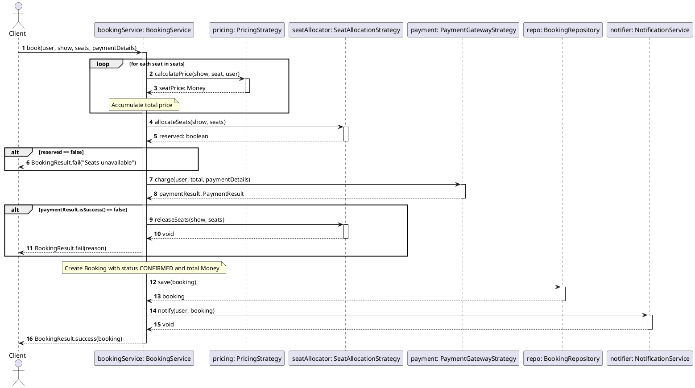

# Movie Booking System (Low-Level Design)

A highly structured, clean-architecture Low-Level Design (LLD) implementation of a Movie Booking System in TypeScript. This project demonstrates object-oriented design principles (SOLID), dependency injection, and several behavioral/creational design patterns.

---

## 🏗️ Architecture & Design Patterns

The project follows clean architectural boundaries by separating data structures, interfaces, and concrete business logic.

### Design Patterns Used
1. **Strategy Pattern**: 
   - **Pricing**: Dynamic calculation using pricing strategies (e.g., peak-hour pricing vs. normal pricing).
   - **Seat Allocation**: Pluggable allocation mechanisms (e.g., in-memory seat locker).
   - **Payment Gateway**: Decoupled interface to easily swap between gateways.
   - **Notification Service**: Flexible implementation of notifying the user (e.g., email notification).
2. **Repository Pattern**: Abstracted persistence using an in-memory data store for `Booking` objects.
3. **Dependency Injection**: Dependencies are passed into the orchestrator `BookingService` constructor to ensure high testability and inversion of control.

---

## 📂 Project Structure

```text
src/
├── enums/            # Domain-specific enumerations (SeatType, BookingStatus, etc.)
├── interfaces/       # Strategy definitions and pluggable interfaces
├── model/            # Core domain entities (User, Movie, Seat, Show, Booking, etc.)
├── repository/       # Data access and storage layers (BookingRepository)
├── service/          # Core orchestrator business logic (BookingService)
├── serviceimpl/      # Concrete implementations of strategies (pricing, payment, etc.)
└── main.ts           # Orchestrator runner and entry point
```

---

## ⚙️ Getting Started

### Prerequisites
- [Node.js](https://nodejs.org/) (v16+)

### Installation
Clone the repository and install the development dependencies:
```bash
npm install
```

### Run the Application
To run the main execution workflow (simulates a user booking seats and receiving an email receipt):
```bash
npm start
```

---

## 📊 UML Diagrams

Below is the PlantUML syntax for the system's design diagrams. You can render these using any PlantUML viewer or editor.

### Class Diagram

```plantuml
@startuml
skinparam style strictuml
skinparam classAttributeIconSize 0

enum SeatType {
  NORMAL
  PREMIUM
  VIP
}

enum SeatStatus {
  AVAILABLE
  BOOKED
}

enum BookingStatus {
  PENDING
  CONFIRMED
  FAILED
  CANCELLED
}

class Money {
  - amount: number
  + constructor(amount: number)
  + getAmount(): number
  + {static} zero(): Money
  + add(newMoney: Money): Money
  + toDisplayString(): string
}

class Address {
  - street: string
  - city: string
  - state: string
  - pincode: string
  + constructor(street: string, city: string, state: string, pincode: string)
  + getStreet(): string
  + setStreet(street: string): void
  + getCity(): string
  + setCity(city: string): void
  + getState(): string
  + setState(state: string): void
  + getPincode(): string
  + setPincode(pincode: string): void
}

class User {
  - id: string
  - name: string
  - email: string
  - phone: string
  - address: Address
  + constructor(id: string, name: string, email: string, phone: string, address: Address)
  + getId(): string
  + setId(id: string): void
  + getName(): string
  + setName(name: string): void
  + getEmail(): string
  + setEmail(email: string): void
  + getPhone(): string
  + setPhone(phone: string): void
  + getAddress(): Address
  + setAddress(address: Address): void
}

class Movie {
  - id: string
  - title: string
  - duration: number
  - genre: string
  - language: string
  - rating: string
  + constructor(id: string, title: string, durationInMinutes: number, genre: string, language: string, rating: string)
  + getId(): string
  + setId(id: string): void
  + getTitle(): string
  + setTitle(title: string): void
  + getDuration(): number
  + setDuration(durationInMinutes: number): void
  + getGenre(): string
  + setGenre(genre: string): void
  + getLanguage(): string
  + setLanguage(language: string): void
  + getRating(): string
  + setRating(rating: string): void
}

class Seat {
  - id: string
  - type: SeatType
  - row: number
  - number: number
  + constructor(id: string, type: SeatType, row: number, number: number)
  + getId(): string
  + setId(id: string): void
  + getType(): SeatType
  + setType(type: SeatType): void
  + getRow(): number
  + setRow(row: number): void
  + getNumber(): number
  + setNumber(number: number): void
}

class Screen {
  - id: string
  - name: string
  - seats: Seat[]
  + constructor(id: string, name: string, seats: Seat[])
  + getId(): string
  + setId(id: string): void
  + getName(): string
  + setName(name: string): void
  + getSeats(): Seat[]
  + setSeats(seats: Seat[]): void
}

class Theater {
  - id: string
  - name: string
  - address: Address
  - screens: Screen[]
  + constructor(id: string, name: string, address: Address, screens: Screen[])
  + getId(): string
  + setId(id: string): void
  + getName(): string
  + setName(name: string): void
}

class Show {
  - id: string
  - movie: Movie
  - screen: Screen
  - startTime: Date
  - endTime: Date
  + constructor(id: string, movie: Movie, screen: Screen, start: Date, end: Date)
  + getId(): string
  + setId(id: string): void
  + getMovie(): Movie
  + setMovie(movie: Movie): void
  + getScreen(): Screen
  + setScreen(screen: Screen): void
  + getStartTime(): Date
  + setStartTime(start: Date): void
  + getEndTime(): Date
  + setEndTime(end: Date): void
}

class PaymentDetails {
  - method: PaymentMethod
  + constructor(method: PaymentMethod)
  + getMethod(): PaymentMethod
}

class PaymentResult {
  - success: boolean
  - transactionId: string | null
  - failureReason: string | null
  + constructor(success: boolean, transactionId: string | null, failureReason: string | null)
  + isSuccess(): boolean
  + setSuccess(success: boolean): void
  + getTransactionId(): string | null
  + setTransactionId(transactionId: string | null): void
  + getFailureReason(): string | null
  + setFailureReason(failureReason: string | null): void
}

class Booking {
  - id: string
  - show: Show
  - user: User
  - seats: Seat[]
  - status: BookingStatus
  - amount: Money
  + constructor(id: string, show: Show, user: User, seats: Seat[], status: BookingStatus, amount: Money)
  + getId(): string
  + setId(id: string): void
  + getShow(): Show
  + setShow(show: Show): void
  + getUser(): User
  + setUser(user: User): void
  + getSeats(): Seat[]
  + setSeats(seats: Seat[]): void
  + getStatus(): BookingStatus
  + setStatus(status: BookingStatus): void
  + getAmount(): Money
  + setAmount(amount: Money): void
}

class BookingResult {
  - ok: boolean
  - booking: Booking | null
  - errorMessage: string | null
  - constructor(ok: boolean, booking: Booking | null, errorMessage: string | null)
  + isOk(): boolean
  + getBooking(): Booking | null
  + getErrorMessage(): string | null
  + {static} success(booking: Booking): BookingResult
  + {static} fail(errorMessage: string): BookingResult
}

interface PricingStrategy {
  + calculatePrice(show: Show, seat: Seat, user: User): Money
}

interface SeatAllocationStrategy {
  + allocateSeats(show: Show, seats: Seat[]): boolean
  + releaseSeats(show: Show, seats: Seat[]): void
}

interface PaymentGatewayStrategy {
  + charge(user: User, amount: Money, paymentMethod: PaymentDetails): PaymentResult
}

interface NotificationService {
  + notify(user: User, booking: Booking): void
}

class DefaultPricingStrategy implements PricingStrategy {
  + calculatePrice(show: Show, seat: Seat, user: User): Money
}

class PeakHourPricingStrategy implements PricingStrategy {
  + calculatePrice(show: Show, seat: Seat, user: User): Money
}

class InMemorySeatAllocationStrategy implements SeatAllocationStrategy {
  - bookedSeats: Set<string>
  - buildKey(showId: string, seatId: string): string
  + allocateSeats(show: Show, seats: Seat[]): boolean
  + releaseSeats(show: Show, seats: Seat[]): void
}

class MockPaymentGateway implements PaymentGatewayStrategy {
  + charge(user: User, amount: Money, details: PaymentDetails): PaymentResult
}

class EmailNotificationService implements NotificationService {
  + notify(user: User, booking: Booking): void
}

class BookingRepository {
  - bookings: Map<string, Booking>
  + save(booking: Booking): Booking
}

class BookingService {
  - seatAllocator: SeatAllocationStrategy
  - pricing: PricingStrategy
  - payment: PaymentGatewayStrategy
  - repo: BookingRepository
  - notifier: NotificationService
  + constructor(pricing: PricingStrategy, seatAllocator: SeatAllocationStrategy, payment: PaymentGatewayStrategy, repo: BookingRepository, notifier: NotificationService)
  + book(user: User, show: Show, seats: Seat[], paymentDetails: PaymentDetails): BookingResult
}

User "1" *--> "1" Address
Theater "1" *--> "*" Screen
Theater "1" *--> "1" Address
Screen "1" *--> "*" Seat
Seat "1" *--> "1" SeatType
Show "1" *--> "1" Movie
Show "1" *--> "1" Screen
Booking "1" *--> "1" Show
Booking "1" *--> "1" User
Booking "1" *--> "*" Seat
Booking "1" *--> "1" BookingStatus
Booking "1" *--> "1" Money
BookingResult "1" *--> "0..1" Booking
BookingService "1" o--> "1" SeatAllocationStrategy
BookingService "1" o--> "1" PricingStrategy
BookingService "1" o--> "1" PaymentGatewayStrategy
BookingService "1" o--> "1" BookingRepository
BookingService "1" o--> "1" NotificationService

@endum
```



### Sequence Diagram


