# Movie Booking System (Low-Level Design)

A production-ready, clean-architecture Low-Level Design (LLD) implementation of a Movie Booking System in TypeScript. This project demonstrates strict adherence to Object-Oriented Design (OOD) principles, SOLID tenets, and Gang of Four (GoF) design patterns across Creational, Structural, and Behavioral paradigms.

---

## 🏗️ Architecture & Core Principles

The codebase is organized into cleanly decoupled layers separating domain models, behavioral contracts, stateful components, and business orchestrators:

- **Single Responsibility Principle (SRP)**: Each component possesses a singular responsibility. Domain entities encapsulate attributes, strategies compute specific business logic, observers handle notifications, and commands encapsulate transactional actions.
- **Open/Closed Principle (OCP)**: The system is openly extensible via polymorphism without modifying tested source code. Dynamic pricing strategies, snack decorators, notification channels, payment chain handlers, and booking workflows can be added seamlessly.
- **Liskov Substitution Principle (LSP)**: All derived implementations (e.g., ticket variants, snack decorators, composite seat components, pricing strategies, and booking workflows) strictly uphold base contract guarantees.
- **Interface Segregation Principle (ISP)**: Granular interfaces (`ISnack`, `SeatComponent`, `Subject`, `Observer`, `Command`, `SeatState`, `PaymentHandler`, `BookingBuilder`, `TicketFactory`) prevent client dependencies on unused signatures.
- **Dependency Inversion Principle (DIP)**: Orchestrators and workflows depend entirely upon abstractions, with concrete implementations injected via Dependency Injection (DI).

---

## 🧩 Design Patterns Catalog

### 1. Creational Patterns

1. **Simple Factory Pattern (`TicketFactory`, `SimpleTicketFactory`)**:
   - Encapsulates polymorphic instantiation of `Ticket` subclasses (`StandardTicket`, `PremiumTicket`, `IMAXTicket`, `ReclinerTicket`) based on `TicketType`.
   - Validates that the assigned `Seat` conforms to the allowed seat types defined by the ticket variant before instantiation.

2. **Builder Pattern (`BookingBuilder`, `RegularBookingBuilder`, `VIPBookingBuilder`)**:
   - Separates the incremental construction of complex `Booking` objects from their representation.
   - Provides a fluent interface for attaching tickets, snacks, coupons, loyalty points, and special requests.
   - Enforces domain invariants before instantiation (e.g., `VIPBookingBuilder` prevents assignment of standard tickets and automatically injects complimentary welcome snacks).

3. **Singleton Pattern (`Logger` implementing `LoggingService`)**:
   - Provides a globally coordinated, lazily initialized logging instance via `Logger.getInstance()`.
   - Injected into `BookingService` and `BookingWorkflow` via constructor injection to safeguard testability.

---

### 2. Structural Patterns

1. **Decorator Pattern (Snack Customization & Add-ons)**:
   - Dynamically decorates base snacks (`Popcorn`, `Soda`, `Nachos`) with toppings, sizes, and packaging (`LargeSizeDecorator`, `ExtraButterDecorator`, `ComboWrapDecorator`, `GlutenFreePackagingDecorator`).
   - Recursively aggregates cumulative pricing, preparation times, descriptions, and dietary allergen tags (`vegetarian`, `contains-dairy`, `combo-deal`, `gluten-free-certified`) without subclass explosion.

2. **Composite Pattern (Theater Layout & Seat Management)**:
   - Establishes a 3-tier tree hierarchy (`Screen` → `Row` → `Seat`) sharing a common `SeatComponent` interface.
   - Enables uniform operations across individual seats and composite containers: contiguous seat lookup, atomic multi-seat reservation, row-level analytics, screen-wide occupancy calculation, and batch price adjustments.

---

### 3. Behavioral Patterns

1. **Strategy Pattern (Dynamic Pricing, Seat Allocation, Payment Gateways)**:
   - Decouples volatile algorithmic logic from core booking orchestrators.
   - **Pricing Strategies**: `WeekdayPricingStrategy` (weekday concession), `WeekendSurgePricingStrategy` (weekend demand surge), `FestivalDiscountPricingStrategy` (promotional festival discounts), `PeakHourPricingStrategy`, `VIPPricingStrategy`, and `DefaultPricingStrategy`.
   - **Seat Allocation Strategies**: `InMemorySeatAllocationStrategy` and `CompositeSeatAllocationStrategy`.
   - **Seat Recommendation Strategies**: `BestAvailableRecommendationStrategy` (optimal viewing center-aisle selection) and `BudgetFriendlyRecommendationStrategy` (lowest price modifier prioritization).
   - **Payment Gateway Strategies**: `MockPaymentGateway` with failure simulation capability.

2. **Observer Pattern (Real-Time Multi-Channel Notifications)**:
   - Implements a decoupled pub/sub notification backbone.
   - Core contracts: `Subject` and `Observer`.
   - Event hierarchy: `BookingEvent` base class with concrete events (`BookingConfirmedEvent`, `ShowReminderEvent`, `OfferBroadcastEvent`).
   - Observers: `EmailNotifier`, `SMSNotifier`, and `PushNotifier`.
   - Uses snapshot array duplication during event dispatch to ensure thread-safe and iteration-safe dynamic subscription and unsubscription.
   - `ObservableNotificationService` bridges `NotificationService` and `BookingSubject` for zero-overhead integration into `BookingService`.

3. **Command Pattern (Transactional Booking & LIFO Rollback)**:
   - Encapsulates discrete transactional operations as reversible command objects implementing `execute(): boolean` and `undo(): void`.
   - Concrete commands: `SelectSeatCommand`, `ReserveSeatCommand`, `ConfirmPaymentCommand`, and `SendConfirmationCommand`.
   - `BookingInvoker` executes command pipelines and maintains a history stack. Upon any downstream failure (e.g., payment declined), it performs an automatic LIFO rollback, undoing prior commands and restoring reserved seats to available status.

4. **State Pattern (Seat Lifecycle Management & Invariant Enforcement)**:
   - Manages seat status transitions through dedicated state objects implementing `SeatState`:
     - `AvailableState`: Initial status. Allows reservation (`reserve()`); throws `InvalidSeatStateException` on release or confirmation.
     - `HeldState`: Temporary reservation. Transitions to `BookedState` on `confirm()`, or `ReleasedState` on `release()`. Throws exception on duplicate reservation.
     - `BookedState`: Confirmed status. Can transition to `ReleasedState` on cancellation (`release()`); prohibits re-reservation or confirmation.
     - `ReleasedState`: Re-enters the booking lifecycle. Can transition back to `HeldState` on `reserve()`; prohibits duplicate release or confirmation without reservation.
   - The `Seat` context delegates lifecycle operations directly to its active state object, eliminating complex conditional switch/if branching and enforcing strict transition rules.

5. **Chain of Responsibility Pattern (Modular Payment Processing Pipeline)**:
   - Processes booking payment transactions through a decoupled sequence of specialized handlers implementing `PaymentHandler` (`BasePaymentHandler`):
     - `CouponValidationHandler`: Validates and applies promotional coupon discounts to the order total.
     - `WalletDeductionHandler`: Deducts payable balance from the user's available digital wallet. If the wallet covers the full amount, marks transaction complete and bypasses downstream payment gateways.
     - `TaxComputationHandler`: Applies statutory taxes (e.g., 18% GST) to the remaining balance.
     - `FinalPaymentGatewayHandler`: Dispatches any remaining balance to the external payment gateway.
   - `PaymentChainBuilder`: Provides a fluent builder to assemble and link handlers into custom processing pipelines.
   - `PaymentContext`: Stateful transaction context tracked across the pipeline, maintaining current balance, user details, coupon, wallet deductions, and applied taxes.

6. **Template Method Pattern (Structured Booking Workflows)**:
   - Defines the invariant skeleton of a booking lifecycle within `BookingWorkflow.processBooking()`, delegating specific steps to specialized subclasses:
     - Step 1: `validateRequest(user, show, seats)` (Primitive operation / abstract hook)
     - Step 2: `allocateSeats(show, seats)` (Concrete step; reserves seats and transitions seat state to `HeldState`)
     - Step 3: `processPayment(user, show, seats, coupon?, paymentDetails?)` (Primitive operation / abstract hook; delegates to payment chain)
     - Step 4: `confirmSeats(seats)` (Concrete step; transitions seat state to `BookedState`)
     - Step 5: `createBooking(user, show, seats, coupon?)` (Concrete step; generates booking record and persists in repository)
     - Step 6: `sendConfirmation(user, show, seats, booking)` (Concrete step; emits notification)
     - Error Recovery: `rollbackSeats(show, seats)` (Concrete step executed in `catch` block; safely releases held seats to `ReleasedState`)
   - Concrete workflows:
     - `RegularBookingWorkflow`: Enforces regular customer constraints (maximum 6 seats limit) and standard pricing.
     - `CorporateBookingWorkflow`: Enforces corporate bulk booking policies (minimum 5 seats limit) and automatically applies percentage volume discounts (e.g., 20%).

---

## 📂 Project Structure

```text
src/
├── chain/            # Chain of Responsibility pattern (PaymentHandler, BasePaymentHandler, Handlers, Builder, Context)
├── command/          # Command pattern (Command, SelectSeat, ReserveSeat, ConfirmPayment, SendConfirmation, BookingInvoker)
├── enums/            # Domain enumerations (SeatType, TicketType, BookingStatus, SeatStatus, PaymentMethod)
├── interfaces/       # Core contracts, builders, factories, strategies, and notification/logging interfaces
├── model/            # Domain entities (User, Movie, Seat, Row, Screen, Show, Booking, Snack, Coupon, Money, Address, etc.)
├── observer/         # Observer pattern (Subject, Observer, BookingSubject, events, notifiers)
│   ├── events/       # Event hierarchy (BookingEvent, BookingConfirmedEvent, ShowReminderEvent, OfferBroadcastEvent)
│   └── notifiers/    # Concrete observers (EmailNotifier, SMSNotifier, PushNotifier)
├── repository/       # Data persistence abstractions and in-memory store (BookingRepository)
├── scenarios/        # Modularized end-to-end demo suites
│   ├── 01_builderDemos.ts          # Scenarios 1-3: Regular/VIP Builder & Invariant Validation
│   ├── 02_structuralDemos.ts       # Scenarios 4-6: Decorator Snacks & Composite Theater Layout
│   ├── 03_behavioralCoreDemos.ts   # Scenarios 7-8: Strategy Pricing & Observer Notifications
│   ├── 04_commandDemos.ts          # Scenarios 9-11: Command Transaction Pipeline & LIFO Rollback
│   ├── 05_stateDemos.ts            # Scenario 12: Seat Lifecycle Transitions & Error Handling
│   ├── 06_chainAndWorkflowDemos.ts # Scenarios 13-15: Payment Pipeline & Template Method Workflows
│   └── index.ts                    # Scenario module exports
├── service/          # Orchestrators and service layer (BookingService)
├── serviceimpl/      # Concrete implementations
│   ├── Logger.ts                   # Thread-safe Singleton logging service
│   ├── notification/               # EmailNotificationService, ObservableNotificationService
│   ├── payment-gateway/            # MockPaymentGateway with failure simulation
│   ├── pricing/                    # Weekday, WeekendSurge, FestivalDiscount, PeakHour, VIP
│   └── seatAllocation/             # InMemorySeatAllocationStrategy, CompositeSeatAllocationStrategy
├── snacks/           # Decorator pattern snack components and concrete decorators
├── state/            # State pattern (SeatState, Available, Held, Booked, Released, Exceptions)
├── tickets/          # Polymorphic ticket hierarchy (StandardTicket, PremiumTicket, IMAXTicket, ReclinerTicket)
├── workflow/         # Template Method pattern (BookingWorkflow, RegularBookingWorkflow, CorporateBookingWorkflow)
└── main.ts           # Application entry point invoking all modular demo suites
```

---

## ⚙️ Getting Started

### Prerequisites

- [Node.js](https://nodejs.org/) (v16 or higher)
- [npm](https://www.npmjs.com/) (v8 or higher)

### Installation

Clone the repository and install dependencies:

```bash
npm install
```

### Run the Application

Execute the end-to-end demonstration runner:

```bash
npm start
```

---

## 🧪 Comprehensive Demo Scenarios

The test suite runs 16 end-to-end scenarios covering all implemented design patterns:

| # | Pattern / Category | Scenario Description |
|---|---|---|
| **1** | Builder Pattern | Regular Booking with Standard + Premium tickets, snacks, and coupon discount. |
| **2** | Builder Pattern | VIP Booking with Premium + Recliner tickets and auto-injected complimentary snack. |
| **3** | Builder Pattern | VIP Booking validation error handling when attempting to add a Standard ticket. |
| **4** | Decorator Pattern | Dynamic snack add-on composition (Popcorn + Extra Butter + Large Size + Combo Wrap + Gluten Free Packaging). |
| **5** | Composite Pattern | 3-tier theater hierarchy (`Screen` → `Row` → `Seat`), contiguous seat search, and occupancy calculation. |
| **6** | Structural Integration | Integrated booking flow combining decorated snacks and composite screen seat allocation. |
| **7** | Strategy Pattern | Dynamic pricing engine: Weekday concession, Weekend demand surge, and Festival promotional discount. |
| **8** | Observer Pattern | Real-time multi-channel event publishing (`EmailNotifier`, `SMSNotifier`, `PushNotifier`) with dynamic detachment. |
| **9** | Command Pattern | Transactional booking execution pipeline via `BookingInvoker` (`Select` → `Reserve` → `Pay` → `Confirm`). |
| **10** | Command Pattern | Automatic LIFO rollback restoring seat availability when payment fails downstream. |
| **11** | Command Integration | `BookingService.bookWithCommands()` end-to-end transactional orchestration. |
| **12** | State Pattern | Seat lifecycle transitions (`AVAILABLE` → `HELD` → `BOOKED` → `RELEASED`) and invalid transition exception handling. |
| **13** | Chain of Responsibility | Modular payment pipeline: Coupon validation → Wallet balance deduction → GST tax computation → Gateway charge. |
| **14** | Template Method | Regular vs Corporate booking workflows: Max seat limits vs Bulk discounts (5+ seats, 20% discount). |
| **15** | Workflow Rollback | Complete booking workflow failure handling with automatic seat release and recovery re-booking. |
| **16** | Extension Scenario (OCP) | Dynamic seat recommendations via `SeatRecommendationStrategy` (`BestAvailable` vs `BudgetFriendly`). |

---

## 📊 UML Diagrams

Below is the PlantUML specification for all system architecture and pattern implementations. You can render these diagrams using any standard PlantUML viewer or IDE plugin.

### 1. Core Domain Class Diagram

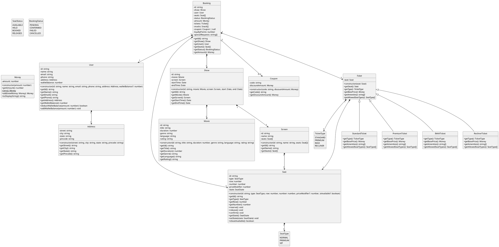
```plantuml
@startuml
skinparam style strictuml
skinparam classAttributeIconSize 0

enum SeatType {
  NORMAL
  PREMIUM
  VIP
}

enum SeatStatus {
  AVAILABLE
  HELD
  BOOKED
  RELEASED
}

enum TicketType {
  STANDARD
  PREMIUM
  IMAX
  RECLINER
}

enum BookingStatus {
  PENDING
  CONFIRMED
  FAILED
  CANCELLED
}

class Money {
  - amount: number
  + constructor(amount: number)
  + getAmount(): number
  + {static} zero(): Money
  + add(newMoney: Money): Money
  + toDisplayString(): string
}

class Address {
  - street: string
  - city: string
  - state: string
  - pincode: string
  + constructor(street: string, city: string, state: string, pincode: string)
  + getStreet(): string
  + getCity(): string
  + getState(): string
  + getPincode(): string
}

class User {
  - id: string
  - name: string
  - email: string
  - phone: string
  - address: Address
  - walletBalance: number
  + constructor(id: string, name: string, email: string, phone: string, address: Address, walletBalance?: number)
  + getId(): string
  + getName(): string
  + getEmail(): string
  + getPhone(): string
  + getAddress(): Address
  + getWalletBalance(): number
  + deductWalletBalance(amount: number): boolean
  + addWalletBalance(amount: number): void
}

class Movie {
  - id: string
  - title: string
  - duration: number
  - genre: string
  - language: string
  - rating: string
  + constructor(id: string, title: string, duration: number, genre: string, language: string, rating: string)
  + getId(): string
  + getTitle(): string
  + getDuration(): number
  + getGenre(): string
  + getLanguage(): string
  + getRating(): string
}

class Seat {
  - id: string
  - type: SeatType
  - row: number
  - number: number
  - priceModifier: number
  - state: SeatState
  + constructor(id: string, type: SeatType, row: number, number: number, priceModifier?: number, isAvailable?: boolean)
  + getId(): string
  + getType(): SeatType
  + getRow(): number
  + getNumber(): number
  + reserve(): void
  + release(): void
  + confirm(): void
  + getState(): SeatState
  + setState(state: SeatState): void
  + isSeatAvailable(): boolean
}

class Screen {
  - id: string
  - name: string
  - seats: Seat[]
  + constructor(id: string, name: string, seats: Seat[])
  + getId(): string
  + getName(): string
  + getSeats(): Seat[]
}

class Show {
  - id: string
  - movie: Movie
  - screen: Screen
  - startTime: Date
  - endTime: Date
  + constructor(id: string, movie: Movie, screen: Screen, start: Date, end: Date)
  + getId(): string
  + getMovie(): Movie
  + getScreen(): Screen
  + getStartTime(): Date
  + getEndTime(): Date
}

class Coupon {
  - code: string
  - discountAmount: Money
  + constructor(code: string, discountAmount: Money)
  + getCode(): string
  + getDiscountAmount(): Money
}

abstract class Ticket {
  - seat: Seat
  + constructor(seat: Seat)
  + getSeat(): Seat
  + {abstract} getType(): TicketType
  + {abstract} getBasePrice(): Money
  + {abstract} getAmenities(): string[]
  + {abstract} getAllowedSeatTypes(): SeatType[]
}

class StandardTicket extends Ticket {
  + getType(): TicketType
  + getBasePrice(): Money
  + getAmenities(): string[]
  + getAllowedSeatTypes(): SeatType[]
}

class PremiumTicket extends Ticket {
  + getType(): TicketType
  + getBasePrice(): Money
  + getAmenities(): string[]
  + getAllowedSeatTypes(): SeatType[]
}

class IMAXTicket extends Ticket {
  + getType(): TicketType
  + getBasePrice(): Money
  + getAmenities(): string[]
  + getAllowedSeatTypes(): SeatType[]
}

class ReclinerTicket extends Ticket {
  + getType(): TicketType
  + getBasePrice(): Money
  + getAmenities(): string[]
  + getAllowedSeatTypes(): SeatType[]
}

class Booking {
  - id: string
  - show: Show
  - user: User
  - seats: Seat[]
  - status: BookingStatus
  - amount: Money
  - tickets: Ticket[]
  - snacks: Snack[]
  - coupon: Coupon | null
  - loyaltyPoints: number
  - specialRequests: string[]
  + getId(): string
  + getShow(): Show
  + getUser(): User
  + getSeats(): Seat[]
  + getStatus(): BookingStatus
  + getAmount(): Money
}

User "1" *--> "1" Address
Screen "1" *--> "*" Seat
Seat "1" *--> "1" SeatType
Show "1" *--> "1" Movie
Show "1" *--> "1" Screen
Ticket "1" *--> "1" Seat
Ticket "1" *--> "1" TicketType
Booking "1" *--> "1" Show
Booking "1" *--> "1" User
Booking "1" *--> "*" Seat
Booking "1" *--> "*" Ticket
Booking "1" o--> "0..1" Coupon
@enduml
```

---

### 2. State Pattern: State Transition Diagram (Seat Lifecycle)

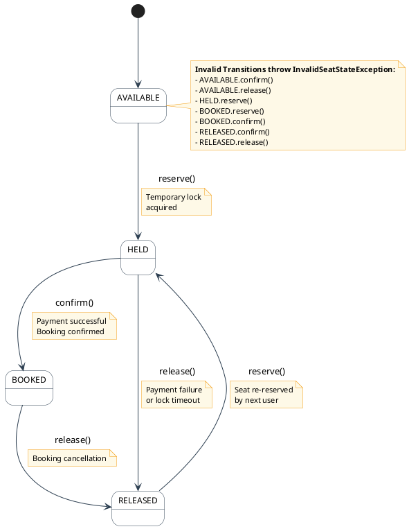
```plantuml
@startuml
skinparam state {
  BackgroundColor White
  BorderColor #2C3E50
  ArrowColor #2C3E50
  StartColor #27AE60
  EndColor #C0392B
  FontName Arial
  FontSize 12
}
skinparam note {
  BackgroundColor #FEF9E7
  BorderColor #F39C12
  FontName Arial
  FontSize 11
}

[*] --> AVAILABLE

AVAILABLE --> HELD : reserve()
note on link
  Temporary lock
  acquired
end note

HELD --> BOOKED : confirm()
note on link
  Payment successful
  Booking confirmed
end note

HELD --> RELEASED : release()
note on link
  Payment failure
  or lock timeout
end note

BOOKED --> RELEASED : release()
note on link
  Booking cancellation
end note

RELEASED --> HELD : reserve()
note on link
  Seat re-reserved
  by next user
end note

note right of AVAILABLE
  <b>Invalid Transitions throw InvalidSeatStateException:</b>
  - AVAILABLE.confirm()
  - AVAILABLE.release()
  - HELD.reserve()
  - BOOKED.reserve()
  - BOOKED.confirm()
  - RELEASED.confirm()
  - RELEASED.release()
end note

@enduml
```

---

### 3. State Pattern: Class Diagram (Seat Lifecycle)

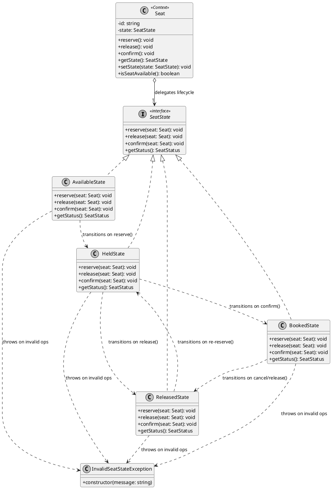
```plantuml
@startuml
skinparam classAttributeIconSize 0
skinparam roundcorner 8
skinparam shadowing false
skinparam monochrome true

interface SeatState <<interface>> {
    +reserve(seat: Seat): void
    +release(seat: Seat): void
    +confirm(seat: Seat): void
    +getStatus(): SeatStatus
}

class AvailableState {
    +reserve(seat: Seat): void
    +release(seat: Seat): void
    +confirm(seat: Seat): void
    +getStatus(): SeatStatus
}

class HeldState {
    +reserve(seat: Seat): void
    +release(seat: Seat): void
    +confirm(seat: Seat): void
    +getStatus(): SeatStatus
}

class BookedState {
    +reserve(seat: Seat): void
    +release(seat: Seat): void
    +confirm(seat: Seat): void
    +getStatus(): SeatStatus
}

class ReleasedState {
    +reserve(seat: Seat): void
    +release(seat: Seat): void
    +confirm(seat: Seat): void
    +getStatus(): SeatStatus
}

class InvalidSeatStateException {
    +constructor(message: string)
}

class Seat <<Context>> {
    -id: string
    -state: SeatState
    +reserve(): void
    +release(): void
    +confirm(): void
    +getState(): SeatState
    +setState(state: SeatState): void
    +isSeatAvailable(): boolean
}

SeatState <|.. AvailableState
SeatState <|.. HeldState
SeatState <|.. BookedState
SeatState <|.. ReleasedState

Seat o--> "1" SeatState : delegates lifecycle
AvailableState ..> HeldState : transitions on reserve()
HeldState ..> BookedState : transitions on confirm()
HeldState ..> ReleasedState : transitions on release()
BookedState ..> ReleasedState : transitions on cancel/release()
ReleasedState ..> HeldState : transitions on re-reserve()

AvailableState ..> InvalidSeatStateException : throws on invalid ops
HeldState ..> InvalidSeatStateException : throws on invalid ops
BookedState ..> InvalidSeatStateException : throws on invalid ops
ReleasedState ..> InvalidSeatStateException : throws on invalid ops
@enduml
```

---

### 4. Chain of Responsibility Pattern Class Diagram (Payment Pipeline)

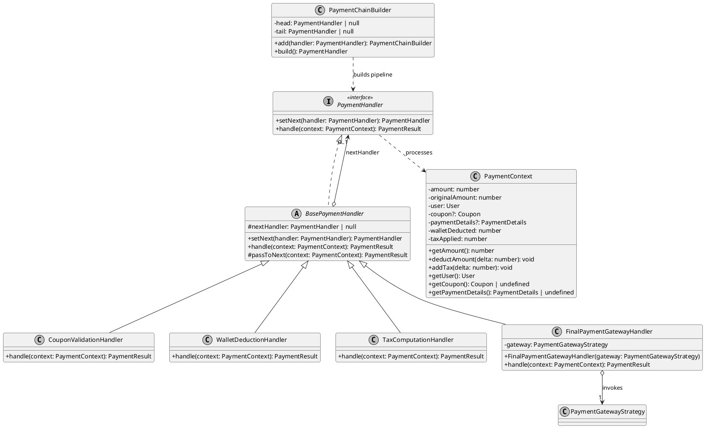
```plantuml
@startuml
skinparam classAttributeIconSize 0
skinparam roundcorner 8
skinparam shadowing false
skinparam monochrome true

interface PaymentHandler <<interface>> {
    +setNext(handler: PaymentHandler): PaymentHandler
    +handle(context: PaymentContext): PaymentResult
}

abstract class BasePaymentHandler {
    #nextHandler: PaymentHandler | null
    +setNext(handler: PaymentHandler): PaymentHandler
    +handle(context: PaymentContext): PaymentResult
    #passToNext(context: PaymentContext): PaymentResult
}

class CouponValidationHandler {
    +handle(context: PaymentContext): PaymentResult
}

class WalletDeductionHandler {
    +handle(context: PaymentContext): PaymentResult
}

class TaxComputationHandler {
    +handle(context: PaymentContext): PaymentResult
}

class FinalPaymentGatewayHandler {
    -gateway: PaymentGatewayStrategy
    +FinalPaymentGatewayHandler(gateway: PaymentGatewayStrategy)
    +handle(context: PaymentContext): PaymentResult
}

class PaymentChainBuilder {
    -head: PaymentHandler | null
    -tail: PaymentHandler | null
    +add(handler: PaymentHandler): PaymentChainBuilder
    +build(): PaymentHandler
}

class PaymentContext {
    -amount: number
    -originalAmount: number
    -user: User
    -coupon?: Coupon
    -paymentDetails?: PaymentDetails
    -walletDeducted: number
    -taxApplied: number
    +getAmount(): number
    +deductAmount(delta: number): void
    +addTax(delta: number): void
    +getUser(): User
    +getCoupon(): Coupon | undefined
    +getPaymentDetails(): PaymentDetails | undefined
}

PaymentHandler <|.. BasePaymentHandler
BasePaymentHandler <|-- CouponValidationHandler
BasePaymentHandler <|-- WalletDeductionHandler
BasePaymentHandler <|-- TaxComputationHandler
BasePaymentHandler <|-- FinalPaymentGatewayHandler

BasePaymentHandler o--> "0..1" PaymentHandler : nextHandler
PaymentChainBuilder ..> PaymentHandler : builds pipeline
PaymentHandler ..> PaymentContext : processes
FinalPaymentGatewayHandler o--> "1" PaymentGatewayStrategy : invokes
@enduml
```

---

### 5. Template Method Pattern Class Diagram (Booking Workflows)

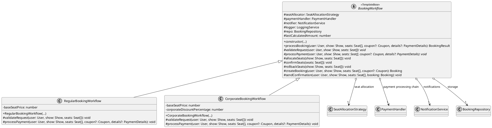
```plantuml
@startuml
skinparam classAttributeIconSize 0
skinparam roundcorner 8
skinparam shadowing false
skinparam monochrome true

abstract class BookingWorkflow <<TemplateBase>> {
    #seatAllocator: SeatAllocationStrategy
    #paymentHandler: PaymentHandler
    #notifier: NotificationService
    #logger: LoggingService
    #repo: BookingRepository
    #lastCalculatedAmount: number
    +constructor(...)
    +processBooking(user: User, show: Show, seats: Seat[], coupon?: Coupon, details?: PaymentDetails): BookingResult
    #{abstract} validateRequest(user: User, show: Show, seats: Seat[]): void
    #{abstract} processPayment(user: User, show: Show, seats: Seat[], coupon?: Coupon, details?: PaymentDetails): void
    #allocateSeats(show: Show, seats: Seat[]): void
    #confirmSeats(seats: Seat[]): void
    #rollbackSeats(show: Show, seats: Seat[]): void
    #createBooking(user: User, show: Show, seats: Seat[], coupon?: Coupon): Booking
    #sendConfirmation(user: User, show: Show, seats: Seat[], booking: Booking): void
}

class RegularBookingWorkflow {
    -baseSeatPrice: number
    +RegularBookingWorkflow(...)
    #validateRequest(user: User, show: Show, seats: Seat[]): void
    #processPayment(user: User, show: Show, seats: Seat[], coupon?: Coupon, details?: PaymentDetails): void
}

class CorporateBookingWorkflow {
    -baseSeatPrice: number
    -corporateDiscountPercentage: number
    +CorporateBookingWorkflow(...)
    #validateRequest(user: User, show: Show, seats: Seat[]): void
    #processPayment(user: User, show: Show, seats: Seat[], coupon?: Coupon, details?: PaymentDetails): void
}

BookingWorkflow <|-- RegularBookingWorkflow
BookingWorkflow <|-- CorporateBookingWorkflow

BookingWorkflow o--> "1" SeatAllocationStrategy : seat allocation
BookingWorkflow o--> "1" PaymentHandler : payment processing chain
BookingWorkflow o--> "1" NotificationService : notifications
BookingWorkflow o--> "1" BookingRepository : storage
@enduml
```

---

### 6. Strategy Pattern Class Diagram (Dynamic Pricing)

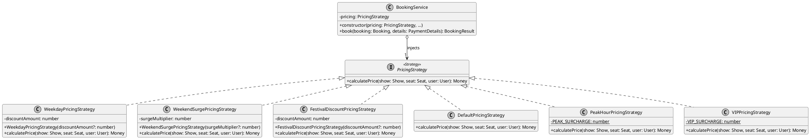
```plantuml
@startuml
skinparam classAttributeIconSize 0
skinparam roundcorner 8
skinparam shadowing false
skinparam monochrome true

interface PricingStrategy <<Strategy>> {
    +calculatePrice(show: Show, seat: Seat, user: User): Money
}

class WeekdayPricingStrategy {
    -discountAmount: number
    +WeekdayPricingStrategy(discountAmount?: number)
    +calculatePrice(show: Show, seat: Seat, user: User): Money
}

class WeekendSurgePricingStrategy {
    -surgeMultiplier: number
    +WeekendSurgePricingStrategy(surgeMultiplier?: number)
    +calculatePrice(show: Show, seat: Seat, user: User): Money
}

class FestivalDiscountPricingStrategy {
    -discountAmount: number
    +FestivalDiscountPricingStrategy(discountAmount?: number)
    +calculatePrice(show: Show, seat: Seat, user: User): Money
}

class DefaultPricingStrategy {
    +calculatePrice(show: Show, seat: Seat, user: User): Money
}

class PeakHourPricingStrategy {
    -{static} PEAK_SURCHARGE: number
    +calculatePrice(show: Show, seat: Seat, user: User): Money
}

class VIPPricingStrategy {
    -{static} VIP_SURCHARGE: number
    +calculatePrice(show: Show, seat: Seat, user: User): Money
}

class BookingService {
    -pricing: PricingStrategy
    +constructor(pricing: PricingStrategy, ...)
    +book(booking: Booking, details: PaymentDetails): BookingResult
}

PricingStrategy <|.. WeekdayPricingStrategy
PricingStrategy <|.. WeekendSurgePricingStrategy
PricingStrategy <|.. FestivalDiscountPricingStrategy
PricingStrategy <|.. DefaultPricingStrategy
PricingStrategy <|.. PeakHourPricingStrategy
PricingStrategy <|.. VIPPricingStrategy

BookingService o--> "1" PricingStrategy : injects
@enduml
```

---

### 7. Observer Pattern Class Diagram (Real-Time Notifications)

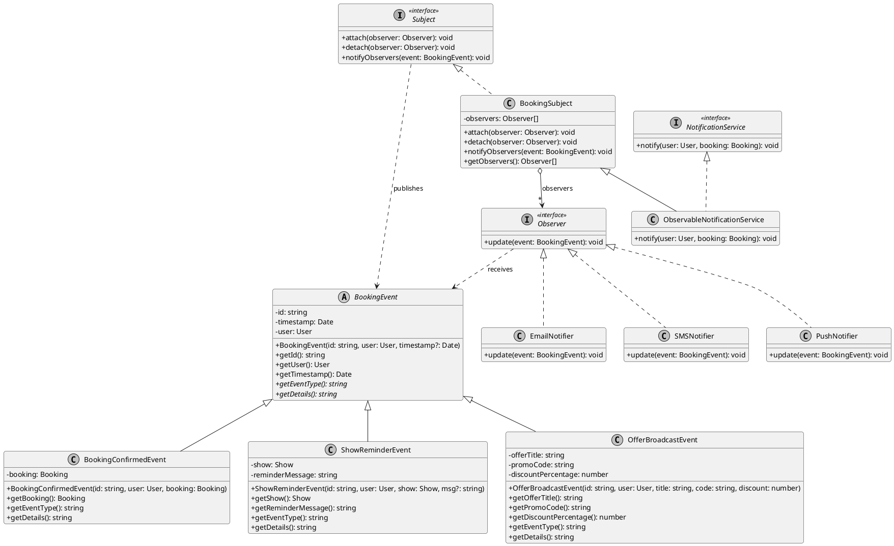
```plantuml
@startuml
skinparam classAttributeIconSize 0
skinparam roundcorner 8
skinparam shadowing false
skinparam monochrome true

interface Subject <<interface>> {
    +attach(observer: Observer): void
    +detach(observer: Observer): void
    +notifyObservers(event: BookingEvent): void
}

interface Observer <<interface>> {
    +update(event: BookingEvent): void
}

abstract class BookingEvent {
    -id: string
    -timestamp: Date
    -user: User
    +BookingEvent(id: string, user: User, timestamp?: Date)
    +getId(): string
    +getUser(): User
    +getTimestamp(): Date
    +{abstract} getEventType(): string
    +{abstract} getDetails(): string
}

class BookingConfirmedEvent {
    -booking: Booking
    +BookingConfirmedEvent(id: string, user: User, booking: Booking)
    +getBooking(): Booking
    +getEventType(): string
    +getDetails(): string
}

class ShowReminderEvent {
    -show: Show
    -reminderMessage: string
    +ShowReminderEvent(id: string, user: User, show: Show, msg?: string)
    +getShow(): Show
    +getReminderMessage(): string
    +getEventType(): string
    +getDetails(): string
}

class OfferBroadcastEvent {
    -offerTitle: string
    -promoCode: string
    -discountPercentage: number
    +OfferBroadcastEvent(id: string, user: User, title: string, code: string, discount: number)
    +getOfferTitle(): string
    +getPromoCode(): string
    +getDiscountPercentage(): number
    +getEventType(): string
    +getDetails(): string
}

class BookingSubject {
    -observers: Observer[]
    +attach(observer: Observer): void
    +detach(observer: Observer): void
    +notifyObservers(event: BookingEvent): void
    +getObservers(): Observer[]
}

class ObservableNotificationService {
    +notify(user: User, booking: Booking): void
}

interface NotificationService <<interface>> {
    +notify(user: User, booking: Booking): void
}

class EmailNotifier {
    +update(event: BookingEvent): void
}

class SMSNotifier {
    +update(event: BookingEvent): void
}

class PushNotifier {
    +update(event: BookingEvent): void
}

BookingEvent <|-- BookingConfirmedEvent
BookingEvent <|-- ShowReminderEvent
BookingEvent <|-- OfferBroadcastEvent

Subject <|.. BookingSubject
BookingSubject <|-- ObservableNotificationService
NotificationService <|.. ObservableNotificationService

Observer <|.. EmailNotifier
Observer <|.. SMSNotifier
Observer <|.. PushNotifier

BookingSubject o--> "*" Observer : observers
Subject ..> BookingEvent : publishes
Observer ..> BookingEvent : receives
@enduml
```

---

### 8. Command Pattern Class Diagram (Transactional Booking & Rollback)

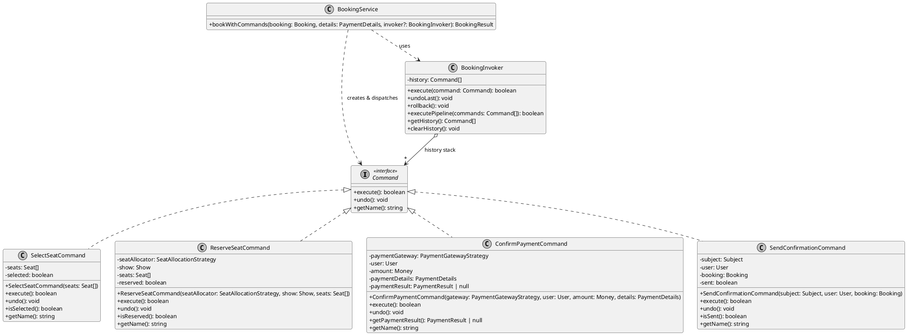
```plantuml
@startuml
skinparam classAttributeIconSize 0
skinparam roundcorner 8
skinparam shadowing false
skinparam monochrome true

interface Command <<interface>> {
    +execute(): boolean
    +undo(): void
    +getName(): string
}

class SelectSeatCommand {
    -seats: Seat[]
    -selected: boolean
    +SelectSeatCommand(seats: Seat[])
    +execute(): boolean
    +undo(): void
    +isSelected(): boolean
    +getName(): string
}

class ReserveSeatCommand {
    -seatAllocator: SeatAllocationStrategy
    -show: Show
    -seats: Seat[]
    -reserved: boolean
    +ReserveSeatCommand(seatAllocator: SeatAllocationStrategy, show: Show, seats: Seat[])
    +execute(): boolean
    +undo(): void
    +isReserved(): boolean
    +getName(): string
}

class ConfirmPaymentCommand {
    -paymentGateway: PaymentGatewayStrategy
    -user: User
    -amount: Money
    -paymentDetails: PaymentDetails
    -paymentResult: PaymentResult | null
    +ConfirmPaymentCommand(gateway: PaymentGatewayStrategy, user: User, amount: Money, details: PaymentDetails)
    +execute(): boolean
    +undo(): void
    +getPaymentResult(): PaymentResult | null
    +getName(): string
}

class SendConfirmationCommand {
    -subject: Subject
    -user: User
    -booking: Booking
    -sent: boolean
    +SendConfirmationCommand(subject: Subject, user: User, booking: Booking)
    +execute(): boolean
    +undo(): void
    +isSent(): boolean
    +getName(): string
}

class BookingInvoker {
    -history: Command[]
    +execute(command: Command): boolean
    +undoLast(): void
    +rollback(): void
    +executePipeline(commands: Command[]): boolean
    +getHistory(): Command[]
    +clearHistory(): void
}

class BookingService {
    +bookWithCommands(booking: Booking, details: PaymentDetails, invoker?: BookingInvoker): BookingResult
}

Command <|.. SelectSeatCommand
Command <|.. ReserveSeatCommand
Command <|.. ConfirmPaymentCommand
Command <|.. SendConfirmationCommand

BookingInvoker o--> "*" Command : history stack
BookingService ..> BookingInvoker : uses
BookingService ..> Command : creates & dispatches
@enduml
```

---

### 9. Decorator Pattern Class Diagram (Snack Add-ons)

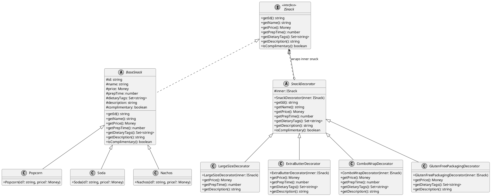
```plantuml
@startuml
skinparam classAttributeIconSize 0
skinparam roundcorner 8
skinparam shadowing false
skinparam monochrome true

interface ISnack <<interface>> {
    +getId(): string
    +getName(): string
    +getPrice(): Money
    +getPrepTime(): number
    +getDietaryTags(): Set<string>
    +getDescription(): string
    +isComplimentary(): boolean
}

abstract class BaseSnack {
    #id: string
    #name: string
    #price: Money
    #prepTime: number
    #dietaryTags: Set<string>
    #description: string
    #complimentary: boolean
    +getId(): string
    +getName(): string
    +getPrice(): Money
    +getPrepTime(): number
    +getDietaryTags(): Set<string>
    +getDescription(): string
    +isComplimentary(): boolean
}

class Popcorn {
    +Popcorn(id?: string, price?: Money)
}

class Soda {
    +Soda(id?: string, price?: Money)
}

class Nachos {
    +Nachos(id?: string, price?: Money)
}

abstract class SnackDecorator {
    #inner: ISnack
    +SnackDecorator(inner: ISnack)
    +getId(): string
    +getName(): string
    +getPrice(): Money
    +getPrepTime(): number
    +getDietaryTags(): Set<string>
    +getDescription(): string
    +isComplimentary(): boolean
}

class LargeSizeDecorator {
    +LargeSizeDecorator(inner: ISnack)
    +getPrice(): Money
    +getPrepTime(): number
    +getDescription(): string
}

class ExtraButterDecorator {
    +ExtraButterDecorator(inner: ISnack)
    +getPrice(): Money
    +getPrepTime(): number
    +getDietaryTags(): Set<string>
    +getDescription(): string
}

class ComboWrapDecorator {
    +ComboWrapDecorator(inner: ISnack)
    +getPrice(): Money
    +getPrepTime(): number
    +getDietaryTags(): Set<string>
    +getDescription(): string
}

class GlutenFreePackagingDecorator {
    +GlutenFreePackagingDecorator(inner: ISnack)
    +getPrice(): Money
    +getDietaryTags(): Set<string>
    +getDescription(): string
}

ISnack <|.. BaseSnack
ISnack <|.. SnackDecorator

BaseSnack <|-- Popcorn
BaseSnack <|-- Soda
BaseSnack <|-- Nachos

SnackDecorator <|-- LargeSizeDecorator
SnackDecorator <|-- ExtraButterDecorator
SnackDecorator <|-- ComboWrapDecorator
SnackDecorator <|-- GlutenFreePackagingDecorator

SnackDecorator o--> "1" ISnack : wraps inner snack
@enduml
```

---

### 10. Composite Pattern Class Diagram (Theater Layout)

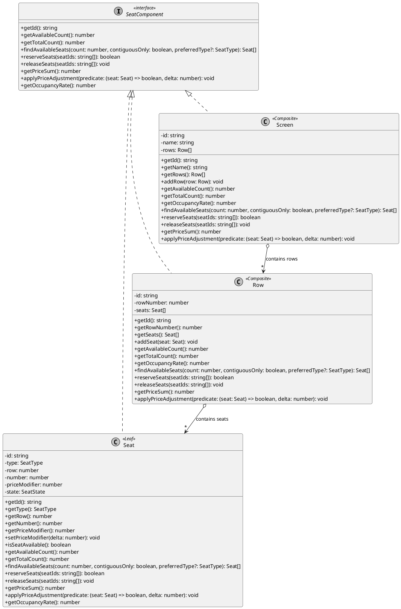
```plantuml
@startuml
skinparam classAttributeIconSize 0
skinparam roundcorner 8
skinparam shadowing false
skinparam monochrome true

interface SeatComponent <<interface>> {
    +getId(): string
    +getAvailableCount(): number
    +getTotalCount(): number
    +findAvailableSeats(count: number, contiguousOnly: boolean, preferredType?: SeatType): Seat[]
    +reserveSeats(seatIds: string[]): boolean
    +releaseSeats(seatIds: string[]): void
    +getPriceSum(): number
    +applyPriceAdjustment(predicate: (seat: Seat) => boolean, delta: number): void
    +getOccupancyRate(): number
}

class Seat <<Leaf>> {
    -id: string
    -type: SeatType
    -row: number
    -number: number
    -priceModifier: number
    -state: SeatState
    +getId(): string
    +getType(): SeatType
    +getRow(): number
    +getNumber(): number
    +getPriceModifier(): number
    +setPriceModifier(delta: number): void
    +isSeatAvailable(): boolean
    +getAvailableCount(): number
    +getTotalCount(): number
    +findAvailableSeats(count: number, contiguousOnly: boolean, preferredType?: SeatType): Seat[]
    +reserveSeats(seatIds: string[]): boolean
    +releaseSeats(seatIds: string[]): void
    +getPriceSum(): number
    +applyPriceAdjustment(predicate: (seat: Seat) => boolean, delta: number): void
    +getOccupancyRate(): number
}

class Row <<Composite>> {
    -id: string
    -rowNumber: number
    -seats: Seat[]
    +getId(): string
    +getRowNumber(): number
    +getSeats(): Seat[]
    +addSeat(seat: Seat): void
    +getAvailableCount(): number
    +getTotalCount(): number
    +getOccupancyRate(): number
    +findAvailableSeats(count: number, contiguousOnly: boolean, preferredType?: SeatType): Seat[]
    +reserveSeats(seatIds: string[]): boolean
    +releaseSeats(seatIds: string[]): void
    +getPriceSum(): number
    +applyPriceAdjustment(predicate: (seat: Seat) => boolean, delta: number): void
}

class Screen <<Composite>> {
    -id: string
    -name: string
    -rows: Row[]
    +getId(): string
    +getName(): string
    +getRows(): Row[]
    +addRow(row: Row): void
    +getAvailableCount(): number
    +getTotalCount(): number
    +getOccupancyRate(): number
    +findAvailableSeats(count: number, contiguousOnly: boolean, preferredType?: SeatType): Seat[]
    +reserveSeats(seatIds: string[]): boolean
    +releaseSeats(seatIds: string[]): void
    +getPriceSum(): number
    +applyPriceAdjustment(predicate: (seat: Seat) => boolean, delta: number): void
}

SeatComponent <|.. Seat
SeatComponent <|.. Row
SeatComponent <|.. Screen

Screen o--> "*" Row : contains rows
Row o--> "*" Seat : contains seats
@enduml
```

---

### 11. Behavioral Architecture Overview Diagram

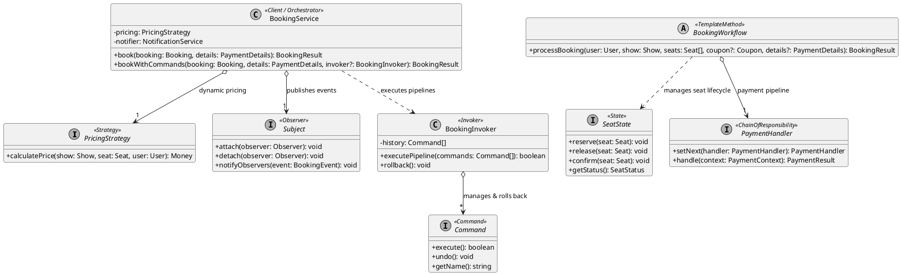
```plantuml
@startuml
skinparam classAttributeIconSize 0
skinparam roundcorner 8
skinparam shadowing false
skinparam monochrome true

interface PricingStrategy <<Strategy>> {
    +calculatePrice(show: Show, seat: Seat, user: User): Money
}

interface Subject <<Observer>> {
    +attach(observer: Observer): void
    +detach(observer: Observer): void
    +notifyObservers(event: BookingEvent): void
}

interface Command <<Command>> {
    +execute(): boolean
    +undo(): void
    +getName(): string
}

class BookingInvoker <<Invoker>> {
    -history: Command[]
    +executePipeline(commands: Command[]): boolean
    +rollback(): void
}

interface SeatState <<State>> {
    +reserve(seat: Seat): void
    +release(seat: Seat): void
    +confirm(seat: Seat): void
    +getStatus(): SeatStatus
}

interface PaymentHandler <<ChainOfResponsibility>> {
    +setNext(handler: PaymentHandler): PaymentHandler
    +handle(context: PaymentContext): PaymentResult
}

abstract class BookingWorkflow <<TemplateMethod>> {
    +processBooking(user: User, show: Show, seats: Seat[], coupon?: Coupon, details?: PaymentDetails): BookingResult
}

class BookingService <<Client / Orchestrator>> {
    -pricing: PricingStrategy
    -notifier: NotificationService
    +book(booking: Booking, details: PaymentDetails): BookingResult
    +bookWithCommands(booking: Booking, details: PaymentDetails, invoker?: BookingInvoker): BookingResult
}

BookingService o--> "1" PricingStrategy : dynamic pricing
BookingService o--> "1" Subject : publishes events
BookingService ..> BookingInvoker : executes pipelines
BookingInvoker o--> "*" Command : manages & rolls back

BookingWorkflow o--> "1" PaymentHandler : payment pipeline
BookingWorkflow ..> SeatState : manages seat lifecycle
@enduml
```

---

## 📑 Assignment Deliverables

- [DESIGN_DOCUMENT.md](DESIGN_DOCUMENT.md): Capstone design document covering SOLID justification, pattern mappings, persistence abstraction, concurrency controls, and the dynamic recommendation extension.
- [UML_Diagrams.pdf](UML_Diagrams.pdf): High-resolution architectural diagram documentation compiling class models, state transitions, pipelines, and workflows.
- [Design_Note.pdf](Design_Note.pdf): Technical design justification note detailing pattern trade-offs, state machine invariants, payment pipeline decoupling, and transactional recovery.
- [Code_Pseudocode.txt](Code_Pseudocode.txt): Clean, comment-free technical specification of classes, interfaces, and pseudocode algorithms for State, Template Method, and Chain of Responsibility patterns.
